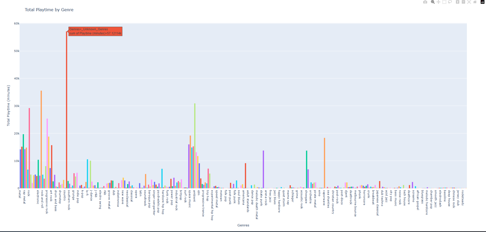
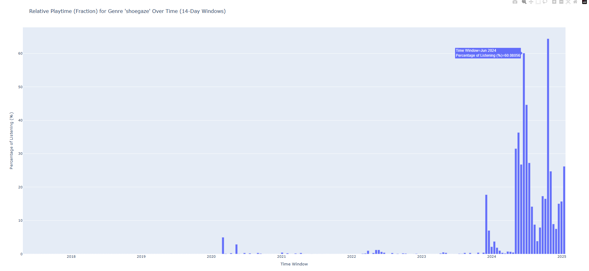
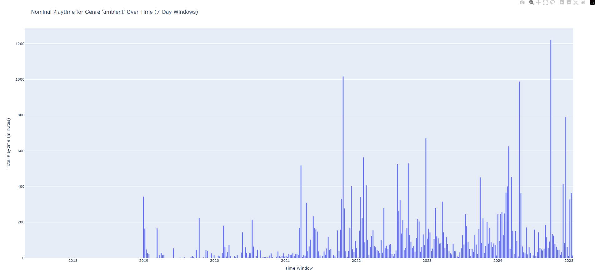

# Spotify Listening Analysis Tool

This tool allows your to view a histogram of your Spotify listening history genres by total milliseconds played per genre. Additionally, you can view your listening history over time for a specific genre while specifying a sliding window size.

## Example Histogram

## Example Genre Analysis 1 — Relative Mode, 14-Day Window

## Example Genre Analysis 2 — Nominal Mode, 7-Day Window

## How to Use

1. Obtain your Spotify [extended streaming history](https://support.spotify.com/uk/article/understanding-my-data/). Spotify says this can take 30 days, but it only took one day for me.  
2. For any song you want to analyze, you'll need to also have its data in a `.csv` file obtained [here](https://www.chosic.com/spotify-playlist-sorter/). Put this file in the `csvgoeshere` directory. This requirement could be problematic if your listening history includes many songs which aren't saved in one of your playlists, since those songs not present in the `.csv` will be skipped over during analysis. Read the **get_track_data.py** section below for more information.  
3. Run `python spotanalyze` from the directory you put this repo in. For example, if you put this repository in your Desktop directory, then you would run the command like so: `C:\Users\myuser\Desktop> python spotanalyze`. This will create a new file `combined_history.json`. This may take a moment if it's the first time running the program. Once the `combined_history.json` exists, future runs of the program will skip this step.  
4. The program will then begin preparing a further refined `.json` file for analysis, named `mydata.json`. This file contains aggregate listening information on a per-track basis. This may also take a moment if it's the first time running the program. Once the `mydata.json` exists, future runs of the program will skip this step.  
5. Next, your browser should automatically launch a new tab containing a histogram, which shows your overall listening history. In the terminal, you'll see options to analyze your listening of a specific genre over time.  
6. Enter a genre you'd like to analyze (make sure the text matches the .csv genre labels exactly), and then specify a sliding window period. Specify yes for relative mode if you want to see % of listening history, and specifying no for relative mode if you want to view the nominal listening time.  
7. Repeat as desired.

## get_track_data.py

You can work with the provided `get_track_data.py` tool if you need to analyze all of your extended listening history, inlcuded songs which don't appear in an existing playlist. This tool downloads track data directly from the Spotify API, which you can use to obtain further information. This data **does not** come with genre information, so you will need to obtain that separately somehow.

Using `get_track_data.py` requires a .env file containing a Spotify Developer API `CLIENT_ID` and `CLIENT_SECRET`. The data which it downloads does not match the expected format of the playlist sorter `.csv` files, so you'll need to know what you're doing to make that work.

## Note
Development streamlined via AI
